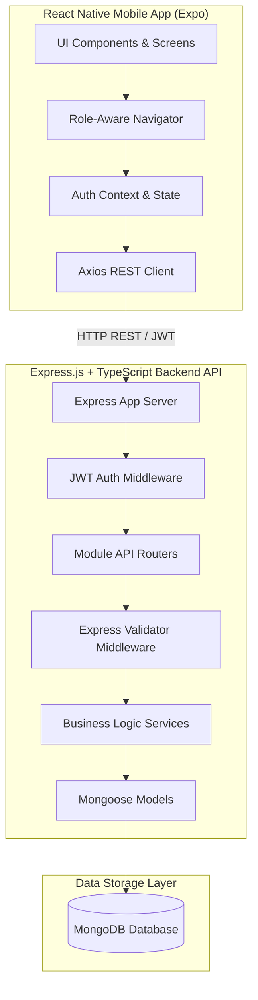

# 🏢 Society & Community Management Application

A full-stack mobile & backend solution designed for residential societies, gated communities, and apartment complexes. Built with Node.js, Express, TypeScript, MongoDB, and React Native (Expo).

---

## 📐 System Architecture & Flow



---

## 👥 Role Capabilities

| Role | Access Level & Key Features |
| :--- | :--- |
| **Admin** | Create & manage announcements, review/resolve complaints, manage facilities, log visitors, view analytics. |
| **Resident** | View notice board, raise & track complaints, book facility slots, RSVP to events, pre-approve guest visitors, view emergency contacts, manage profile. |
| **Security** | Access visitor entry log, check-in pre-approved visitors, check-out departing visitors, access 24/7 emergency contact directory. |

---

## 🛠️ Technology Stack

- **Backend**: Node.js, Express, TypeScript, Mongoose (MongoDB), JSON Web Tokens (JWT), bcryptjs, Helmet, Express-Validator, Winston Logger, Jest + Supertest.
- **Frontend**: React Native (Expo SDK 51), TypeScript, React Navigation (Native Stack + Bottom Tabs), Axios, React Context API.

---

## 🚀 Quick Setup & Run Instructions

### 1. Prerequisites
- **Node.js**: v18+
- **MongoDB**: Local MongoDB instance running on `mongodb://localhost:27017` or a MongoDB Atlas URI.

### 2. Backend Setup
```bash
# Navigate to backend directory
cd backend

# Install dependencies
npm install

# Configure environment variables (preconfigured in .env)
# MONGODB_URI=mongodb://localhost:27017/society-management
# JWT_SECRET=super-secret-jwt-key-for-hackathon-2026

# Seed demo society and accounts
npm run seed

# Run backend development server
npm run dev
```

Server will start on **`http://localhost:5000`**. Health check: `http://localhost:5000/health`.

### 3. Run Backend Tests
```bash
cd backend
npm test
```

---

### 4. Mobile App Setup (Frontend)
```bash
# Navigate to frontend directory
cd frontend

# Install dependencies
npm install

# Start Expo dev server
npx expo start
```

Press `w` for Web preview, `a` for Android Emulator, or scan the QR code using Expo Go on your mobile device.

---

## 🔑 Demo Login Credentials (Seeded)

| Role | Email | Password |
| :--- | :--- | :--- |
| **Admin** | `admin@greenvalley.com` | `Password123!` |
| **Resident** | `resident@greenvalley.com` | `Password123!` |
| **Security** | `security@greenvalley.com` | `Password123!` |

> Note: Quick single-click demo login buttons are provided on the Login screen for fast testing.

---

## 🧪 Implemented Modules & Features

1. **Authentication**: JWT authentication, registration with society binding, role-aware navigation.
2. **Digital Notice Board / Announcements**: Categorized notices, pinned posts, admin creation interface.
3. **Service Requests & Complaints**: Priority-based complaints, status lifecycle (`pending` → `in_progress` → `resolved`), admin quick status action buttons.
4. **Events & Meetings**: Event listings, meeting links, RSVP tracking (`going`, `maybe`, `not_going`).
5. **Facility Booking**: View amenities, rate/capacity info, slot booking system, user booking history.
6. **Visitor Management**: Gate entry logging, resident guest pre-approval, check-in / check-out actions.
7. **Emergency Directory**: Quick access contact list with 24/7 indicator badges.
8. **In-App Notifications**: Unread notifications list with "Mark All as Read" action.

---

## 📋 Evaluation Rubric Checklist

- [x] Backend imports & path mismatches fixed (`app.ts` import updated to `./modules/event/event.routes`).
- [x] Package configs (`package.json`, `tsconfig.json`, `.env`, `.gitignore`) created.
- [x] Complete seed script creating Society + Admin + Resident + Security demo users.
- [x] Backend unit test suite with Jest & Supertest.
- [x] Full mobile app built in Expo React Native with clean modular architecture (`api/`, `screens/`, `components/`, `navigation/`, `context/`, `types/`).
- [x] Loading, Empty, and Error states explicitly handled on every screen.
- [x] Incremental git commits made across development.
